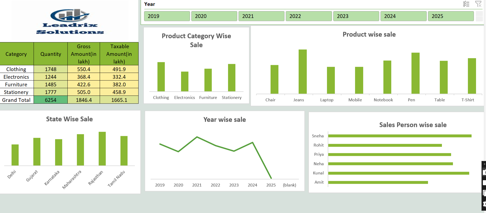

#  Leadrix Solutions – Sales Analytics Dashboard



An Excel-based interactive sales dashboard built for **Leadrix Solutions**, analyzing B2B sales performance across product categories, states, salespersons, and years (2019–2025).

---

##  Problem Statement

Leadrix Solutions, a multi-category B2B sales company operating across several Indian states, needed a centralized dashboard to monitor and evaluate its sales performance over time. The management faced challenges in identifying:

- Which **product categories** and **individual products** drive the most revenue
- How sales **vary across states** and which regions need more focus
- Which **salespersons** are performing best and which need support
- How **yearly trends** reveal growth or decline patterns from 2019 to 2025
- What the overall **gross and taxable amounts** look like per category

The goal was to build a clean, filterable Excel dashboard that enables data-driven decisions around inventory planning, regional strategy, and sales team performance.

---

## Dashboard Preview


---

## Summary Table

| Category | Quantity | Gross Amount (in lakh) | Taxable Amount (in lakh) |
|------------|----------|------------------------|--------------------------|
| Clothing | 1,748 | 550.4 | 491.9 |
| Electronics | 1,244 | 368.4 | 332.4 |
| Furniture | 1,485 | 422.6 | 382.0 |
| Stationery | 1,777 | 505.0 | 458.9 |
| **Grand Total** | **6,254** | **1,846.4** | **1,665.1** |

---

##  Charts & Visuals

### 1. Product Category Wise Sale
- **Type:** Column Chart
- **Insight:** Clothing has the highest gross amount (₹550.4L), followed by Stationery (₹505.0L). Electronics is the lowest performer.

### 2. Product Wise Sale
- **Type:** Column Chart
- **Insight:** Jeans is the top-selling product, followed by Pen and T-Shirt. Mobile and Laptop are the lowest.

### 3. State Wise Sale
- **Type:** Column Chart
- **Insight:** Rajasthan leads in sales, followed by Maharashtra. Delhi has the lowest sales among all states.

### 4. Year Wise Sale
- **Type:** Line Chart
- **Insight:** Sales peaked in 2021, followed by a recovery in 2024. A sharp drop is visible in 2025 (partial year data).

### 5. Sales Person Wise Sale
- **Type:** Horizontal Bar Chart
- **Insight:** Sneha is the top-performing salesperson, while Amit has the lowest revenue contribution.

---

##  Key Questions Answered

1. Which product category generates the highest gross and taxable amount?
2. Which individual product has the highest sales quantity and revenue?
3. Which Indian state contributes the most to overall sales?
4. How has yearly revenue trended from 2019 to 2025?
5. Who is the best-performing salesperson, and who needs improvement?
6. What is the gap between gross amount and taxable amount across categories?

---

##  Files

| File | Description |
|------|-------------|
| `excel_dashborad.xlsx` | Source data + pivot tables + dashboard |
| `leadrix_soluton.png` | Dashboard screenshot |
| `README_Leadrix.md` | This file |

---

##  Tools Used

- **Microsoft Excel** – Pivot Tables, Slicers, Charts
- **Data Sheet:** `Clean_Sales_Data_2` (400 rows, 19 columns)

---

##  Getting Started

1. Clone or download this repository
   ```bash
   git clone https://github.com/your-username/your-repo-name.git
   ```
2. Open `excel_dashborad.xlsx` in Microsoft Excel
3. Use the **Year slicer** at the top to filter data by year (2019–2025)
4. Explore each chart panel for category, product, state, and salesperson insights
